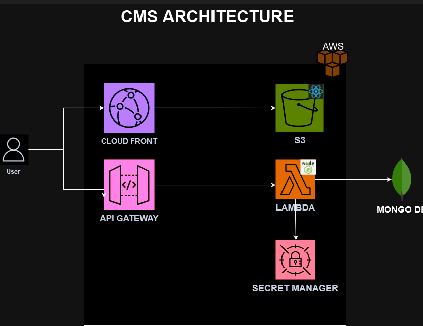

# Contact Management System

This repository contains the Contact Management System, a serverless web application designed to help users manage their contacts efficiently. The system is split into three main parts:

1. **Frontend**: A user-friendly web interface for managing contacts.
2. **Backend**: A serverless API that handles all CRUD operations for contacts.
3. **Infrastructure**: Infrastructure-as-code (IaC) to provision AWS resources for both the frontend and backend.

## Frontend

- **Folder**: `frontendShell/`
- **Purpose**: Provides the web interface for managing contacts.
- **Hosted On**: AWS CloudFront, serving static files.
- **Technologies**: Tailwind CSS, React JS.

## Backend

- **Folder**: `backendShell/`
- **Purpose**: Provides a serverless API for handling contact management requests (CRUD operations).
- **Hosted On**: AWS Lambda, with API Gateway managing HTTP requests.
- **Database**: Contacts are stored in Mongo DB for high availability and performance.
- **Technologies**: Node.js, AWS Lambda, AWS API Gateway, Mongo DB.

## Infrastructure

- **Folder**: `infra/`
- **Purpose**: Defines and deploys AWS resources for the frontend and backend using AWS CDK (Cloud Development Kit).
- **Key Resources**:
  - AWS CloudFront for the frontend.
  - API Gateway for managing API requests.
  - AWS Lambda for serverless backend logic.
  - Mongo DB for contact data storage.
  
## Architecture Overview


The Contact Management System uses a **serverless architecture** on AWS, allowing for high scalability and low operational costs. Here’s a high-level overview of the architecture:

- **Frontend**: Hosted on AWS CloudFront, delivering static web content to users with low latency.
- **Backend**: Consists of Lambda functions that handle contact management operations. Requests are routed through **API Gateway**, which serves as the entry point for the backend.
- **Database**: Contacts are stored in **Mongo DB**, a highly scalable NoSQL database, ensuring fast access and seamless scaling.
- **Infrastructure**: Defined using **AWS CDK**, making infrastructure deployment automated, repeatable, and version-controlled.

## Deployment

To deploy the system, follow these steps:

1. **Frontend Deployment**:
    - Navigate to `frontendShell/` and build the frontend application.

2. **Backend Deployment**:
    - Navigate to `backendShell/`

3. **Infrastructure Deployment**:
    - Navigate to `infra/` and run the CDK deployment script to provision AWS resources:
      ```bash
      cd infra
      npm install
      npx cdk deploy
      ```

## Video Demonstration

You can view a video demonstration of the system architecture, frontend, backend, and infrastructure code:

[Watch the Video](https://www.loom.com/share/98fb824733d5494ab7c67082ced1a213?sid=ef31496e-266a-4da7-bcc7-e2c300a34349)
