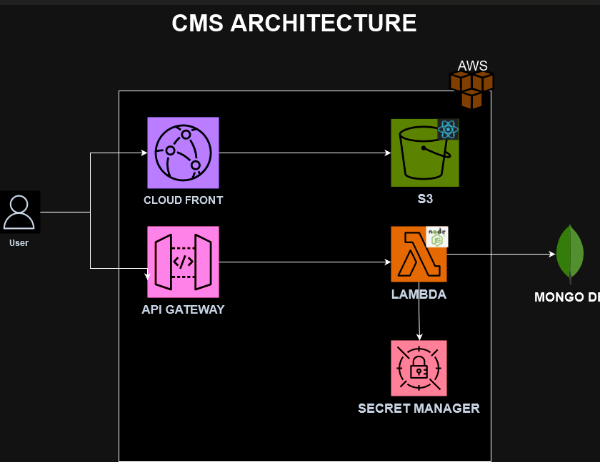

# Infrastructure Stack for Contact Management System

## Overview
This document describes the infrastructure stack for the Contact Management System (CMS) built using AWS CDK. The stack provisions the necessary AWS resources to host the frontend application and support the backend API.




## Technology Used
- **Infrastructure as Code**: AWS CDK (Cloud Development Kit)
- **Languages**: JavaScript (Node.js)
- **AWS Services**:
  - Amazon S3 for static website hosting
  - AWS Lambda for backend processing
  - Amazon API Gateway for HTTP API management
  - AWS CloudFront for content delivery
  - AWS Secrets Manager for managing sensitive information

## Architecture
The infrastructure stack consists of the following components:

1. **S3 Bucket**: 
   - Stores the frontend application files.
   - Configured to block public access and delete objects automatically upon stack removal.

2. **Lambda Function**: 
   - Serves as the backend logic for the application.
   - Configured with a memory size of 512 MB and a timeout of 30 seconds.

3. **API Gateway**:
   - Manages HTTP requests to the backend Lambda function.
   - Configured with CORS to allow requests from any origin.
   - Supports GET, POST, PUT, and DELETE methods.

4. **CloudFront Distribution**:
   - Provides a secure and fast way to serve the frontend application hosted in the S3 bucket.
   - Handles error responses, serving the `index.html` file for 404 errors.

5. **Secrets Manager**:
   - Stores sensitive information like the MongoDB connection URL.
   - Grants read permissions to the backend Lambda function.

## Getting Started

### Prerequisites
- AWS account with necessary permissions.
- AWS CDK installed on your machine.

### Deploying the Stack
To deploy the infrastructure stack, follow these steps:

1. Clone the repository containing the CDK stack.
2. Navigate to the directory where the `InfraStack` file is located.
3. Install necessary dependencies:

   ```bash
   npm install
   npx cdk deploy
